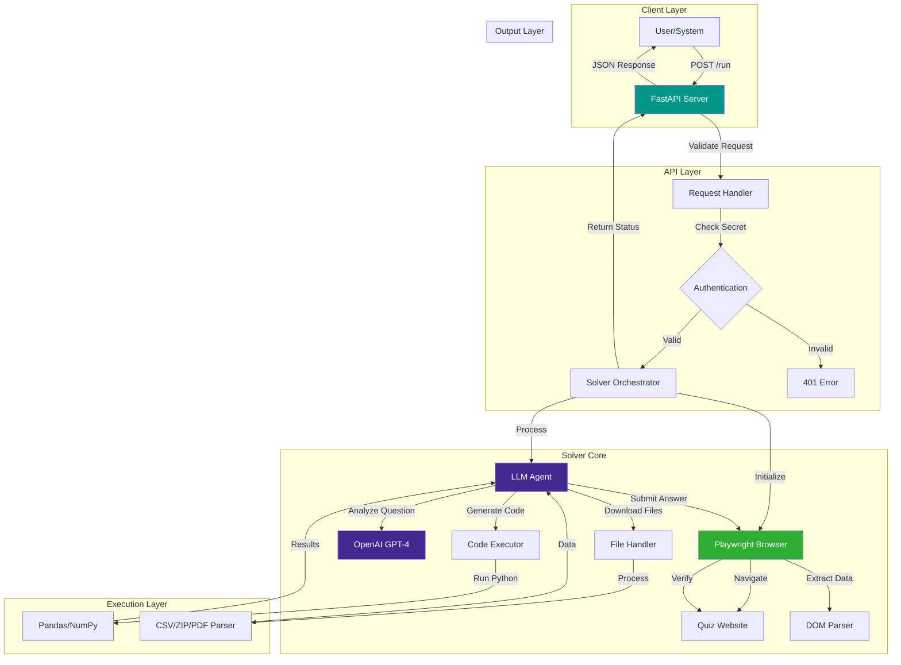
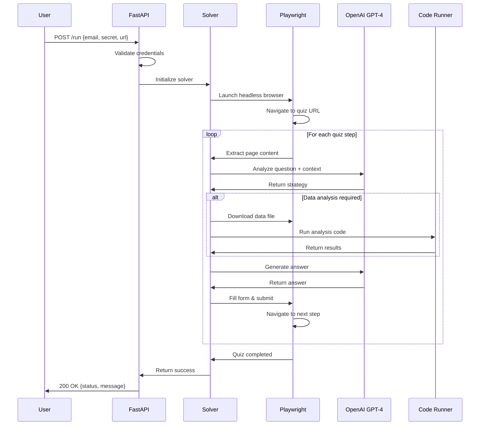

# # 🤖 LLM Analysis Quiz Solver

> An autonomous AI agent that intelligently solves data analysis quizzes using LLM reasoning, browser automation, and code execution

[](https://fastapi.tiangolo.com/)
[](https://openai.com/)
[](https://playwright.dev/)
[](https://www.docker.com/)
[](https://www.python.org/)
[](https://opensource.org/licenses/MIT)

---

## 📋 Table of Contents

- [Overview](#-overview)
- [Features](#-features)
- [Architecture](#-architecture)
- [How It Works](#-how-it-works)
- [Installation](#-installation)
- [Usage](#-usage)
- [API Reference](#-api-reference)
- [Deployment](#-deployment)
- [Project Structure](#-project-structure)
- [Configuration](#-configuration)

---

## 🎯 Overview

The **LLM Analysis Quiz Solver** is an intelligent autonomous agent designed to solve complex data analysis quizzes automatically. Built for the **TDS (Tools in Data Science) Project 2**, this system combines the power of Large Language Models (OpenAI GPT-4) with browser automation (Playwright) to navigate quiz interfaces, analyze data, execute code, and submit answers—all without human intervention.

### Key Highlights

✅ **Fully Autonomous** - No manual intervention required once started  
✅ **Multi-Step Reasoning** - Handles complex, multi-stage quiz workflows  
✅ **Code Execution** - Runs Python code dynamically to analyze data  
✅ **File Handling** - Downloads and processes CSV, ZIP, PDF, and other data files  
✅ **Browser Automation** - Interacts with web interfaces using Playwright  
✅ **RESTful API** - Easy integration via FastAPI endpoints  
✅ **Docker Support** - Containerized deployment for consistency  

---

## ✨ Features

### 🧠 Intelligent Problem Solving
- **LLM-Powered Reasoning**: Uses OpenAI GPT-4 to understand quiz questions and formulate solutions
- **Context Awareness**: Maintains state across multi-step quiz workflows
- **Adaptive Strategy**: Adjusts approach based on question type and data format

### 🌐 Browser Automation
- **Headless Browser Control**: Navigates quiz interfaces using Playwright
- **Dynamic Element Detection**: Finds and interacts with form fields, buttons, and inputs
- **Screenshot Capture**: Takes screenshots for debugging and verification
- **Session Management**: Handles cookies, authentication, and state persistence

### 📊 Data Analysis Capabilities
- **Multi-Format Support**: Processes CSV, Excel, JSON, ZIP archives, and PDFs
- **Code Generation**: Writes and executes Python code for data analysis
- **Pandas Integration**: Leverages pandas for data manipulation and statistics
- **Error Handling**: Robust error recovery and retry mechanisms

### 🔧 Developer-Friendly
- **RESTful API**: Simple POST endpoint for quiz submission
- **Environment Configuration**: Secure credential management via `.env`
- **Docker Deployment**: One-command containerized deployment
- **Logging & Debugging**: Comprehensive logging for troubleshooting

---

## 🏗️ Architecture

### System Architecture Diagram



### Component Interaction Flow



---

## 🔍 How It Works

### Step-by-Step Process

1. **API Request Received**
   - User sends POST request with email, secret, and quiz URL
   - FastAPI validates credentials against environment variables

2. **Browser Initialization**
   - Playwright launches a headless Chromium browser
   - Navigates to the provided quiz URL

3. **Question Analysis**
   - Extracts page content (HTML, text, form fields)
   - Sends context to OpenAI GPT-4 for interpretation

4. **Solution Strategy**
   - LLM determines question type (multiple choice, data analysis, etc.)
   - Formulates a step-by-step solution approach

5. **Data Processing** (if required)
   - Downloads data files (CSV, ZIP, PDF)
   - Generates Python code for analysis
   - Executes code using `exec()` with pandas/numpy

6. **Answer Submission**
   - Fills form fields with computed answers
   - Clicks submit button
   - Handles navigation to next question

7. **Iteration**
   - Repeats steps 3-6 for each quiz question
   - Maintains context across steps

8. **Completion**
   - Returns success status to API
   - Closes browser and cleans up resources

---

## 🚀 Installation

### Prerequisites

- **Python 3.8+** (recommended: 3.10 or 3.11)
- **pip** (Python package manager)
- **OpenAI API Key** ([Get one here](https://platform.openai.com/api-keys))
- **Git** (for cloning the repository)

### Local Setup

1. **Clone the repository**
   ```bash
   git clone https://github.com/zetroretron/llm-analysis-quiz-solver_TDS_Project_2.git
   cd llm-analysis-quiz-solver_TDS_Project_2
   ```

2. **Create a virtual environment** (recommended)
   ```bash
   python -m venv venv
   
   # On Windows
   venv\Scripts\activate
   
   # On macOS/Linux
   source venv/bin/activate
   ```

3. **Install dependencies**
   ```bash
   pip install -r requirements.txt
   playwright install
   ```
   
   > **Note**: `playwright install` downloads browser binaries (~300MB)

4. **Configure environment variables**
   ```bash
   cp .env.example .env
   ```
   
   Edit `.env` and add your credentials:
   ```env
   OPENAI_API_KEY=sk-your-openai-api-key-here
   STUDENT_SECRET=your-secret-passphrase
   ```

5. **Run the server**
   ```bash
   uvicorn main:app --host 0.0.0.0 --port 8000
   ```

6. **Verify installation**
   Open your browser and navigate to:
   ```
   http://localhost:8000/docs
   ```
   You should see the FastAPI interactive documentation.

---

## 💻 Usage

### Making API Requests

#### Using cURL

```bash
curl -X POST "http://localhost:8000/run" \
  -H "Content-Type: application/json" \
  -d '{
    "email": "your.email@example.com",
    "secret": "your-secret-passphrase",
    "url": "https://example.com/quiz-task"
  }'
```

#### Using Python `requests`

```python
import requests

response = requests.post(
    "http://localhost:8000/run",
    json={
        "email": "your.email@example.com",
        "secret": "your-secret-passphrase",
        "url": "https://example.com/quiz-task"
    }
)

print(response.json())
```

#### Using JavaScript `fetch`

```javascript
fetch('http://localhost:8000/run', {
  method: 'POST',
  headers: {
    'Content-Type': 'application/json',
  },
  body: JSON.stringify({
    email: 'your.email@example.com',
    secret: 'your-secret-passphrase',
    url: 'https://example.com/quiz-task'
  })
})
.then(response => response.json())
.then(data => console.log(data));
```

### Response Format

**Success Response (200 OK):**
```json
{
  "status": "success",
  "message": "Quiz solved successfully",
  "steps_completed": 5,
  "execution_time": "45.3s"
}
```

**Error Response (401 Unauthorized):**
```json
{
  "detail": "Invalid secret"
}
```

**Error Response (500 Internal Server Error):**
```json
{
  "status": "error",
  "message": "Failed to solve quiz: [error details]"
}
```

---

## 📡 API Reference

### Endpoints

#### `POST /run`

Initiates the quiz-solving process.

**Request Body:**

| Field | Type | Required | Description |
|-------|------|----------|-------------|
| `email` | string | Yes | Student email address |
| `secret` | string | Yes | Authentication secret (must match `STUDENT_SECRET` in `.env`) |
| `url` | string | Yes | URL of the quiz to solve |

**Example Request:**
```json
{
  "email": "student@example.com",
  "secret": "my-secure-passphrase",
  "url": "https://quiz-platform.com/task/12345"
}
```

**Response Codes:**

| Code | Description |
|------|-------------|
| 200 | Quiz solved successfully |
| 401 | Invalid secret (authentication failed) |
| 422 | Validation error (missing/invalid fields) |
| 500 | Internal server error (solver failed) |

#### `GET /`

Health check endpoint.

**Response:**
```json
{
  "message": "LLM Quiz Solver API is running",
  "version": "1.0.0"
}
```

#### `GET /docs`

Interactive API documentation (Swagger UI).

#### `GET /redoc`

Alternative API documentation (ReDoc).

---

## 🐳 Deployment

### Docker Deployment

#### Build the Docker Image

```bash
docker build -t quiz-solver .
```

#### Run the Container

```bash
docker run -p 8000:8000 --env-file .env quiz-solver
```

#### Using Docker Compose

Create a `docker-compose.yml`:

```yaml
version: '3.8'

services:
  quiz-solver:
    build: .
    ports:
      - "8000:8000"
    env_file:
      - .env
    restart: unless-stopped
```

Run with:
```bash
docker-compose up -d
```

### Cloud Deployment

#### Deploy to Railway

1. Fork this repository
2. Go to [Railway.app](https://railway.app/)
3. Click "New Project" → "Deploy from GitHub repo"
4. Select your forked repository
5. Add environment variables:
   - `OPENAI_API_KEY`
   - `STUDENT_SECRET`
6. Deploy!

#### Deploy to Render

1. Go to [Render.com](https://render.com/)
2. Click "New" → "Web Service"
3. Connect your GitHub repository
4. Configure:
   - **Build Command:** `pip install -r requirements.txt && playwright install`
   - **Start Command:** `uvicorn main:app --host 0.0.0.0 --port $PORT`
5. Add environment variables
6. Deploy!

#### Deploy to Google Cloud Run

```bash
# Build and push to Google Container Registry
gcloud builds submit --tag gcr.io/YOUR_PROJECT_ID/quiz-solver

# Deploy to Cloud Run
gcloud run deploy quiz-solver \
  --image gcr.io/YOUR_PROJECT_ID/quiz-solver \
  --platform managed \
  --region us-central1 \
  --allow-unauthenticated \
  --set-env-vars OPENAI_API_KEY=your-key,STUDENT_SECRET=your-secret
```

---

## 📁 Project Structure

```
llm-analysis-quiz-solver_TDS_Project_2/
├── main.py                 # FastAPI application entry point
├── solver.py               # Core solver logic (LLM + Playwright)
├── tools.py                # Helper functions (file download, code exec)
├── requirements.txt        # Python dependencies
├── Dockerfile              # Docker configuration
├── .env.example            # Environment variables template
├── .gitignore              # Git ignore rules
├── README.md               # This file
│
├── downloads/              # Temporary storage for downloaded files
│   └── (auto-generated)
│
└── screenshots/            # Browser screenshots for debugging
    └── (auto-generated)
```

### File Descriptions

| File | Purpose |
|------|---------|
| **main.py** | FastAPI server setup, routes, and request handling |
| **solver.py** | Main solver orchestration: browser control, LLM interaction, quiz navigation |
| **tools.py** | Utility functions: file downloads, code execution, data parsing |
| **requirements.txt** | Python package dependencies (FastAPI, Playwright, OpenAI, etc.) |
| **Dockerfile** | Container configuration for Docker deployment |
| **.env.example** | Template for environment variables (copy to `.env`) |

---

## ⚙️ Configuration

### Environment Variables

Create a `.env` file in the project root:

```env
# OpenAI Configuration
OPENAI_API_KEY=sk-proj-xxxxxxxxxxxxxxxxxxxxx
OPENAI_MODEL=gpt-4  # or gpt-4-turbo, gpt-3.5-turbo

# Authentication
STUDENT_SECRET=your-secure-passphrase-here

# Optional: Logging
LOG_LEVEL=INFO  # DEBUG, INFO, WARNING, ERROR

# Optional: Browser Settings
HEADLESS=true  # Set to false for debugging
BROWSER_TIMEOUT=30000  # Timeout in milliseconds
```

### Customization Options

#### Change LLM Model

Edit `solver.py`:
```python
# Use GPT-3.5 for faster/cheaper responses
response = openai.ChatCompletion.create(
    model="gpt-3.5-turbo",  # Change from gpt-4
    messages=[...]
)
```

#### Adjust Browser Timeout

Edit `solver.py`:
```python
browser = await playwright.chromium.launch(
    headless=True,
    timeout=60000  # Increase to 60 seconds
)
```

#### Enable Visible Browser (for debugging)

Edit `solver.py`:
```python
browser = await playwright.chromium.launch(
    headless=False,  # Show browser window
    slow_mo=1000     # Slow down actions by 1 second
)
```

---

## 🧪 Testing

### Manual Testing

1. Start the server:
   ```bash
   uvicorn main:app --reload
   ```

2. Use the interactive docs at `http://localhost:8000/docs`

3. Click "Try it out" on the `/run` endpoint

4. Fill in the request body and execute

### Automated Testing

Create a test script `test_solver.py`:

```python
import requests

def test_quiz_solver():
    response = requests.post(
        "http://localhost:8000/run",
        json={
            "email": "test@example.com",
            "secret": "your-secret",
            "url": "https://example.com/quiz"
        }
    )
    assert response.status_code == 200
    assert response.json()["status"] == "success"

if __name__ == "__main__":
    test_quiz_solver()
    print("✅ Test passed!")
```

---

## 🛠️ Troubleshooting

### Common Issues

**Issue: "Playwright browser not found"**
```bash
# Solution: Install Playwright browsers
playwright install
```

**Issue: "Invalid OpenAI API key"**
```bash
# Solution: Check your .env file
cat .env | grep OPENAI_API_KEY
# Verify the key at https://platform.openai.com/api-keys
```

**Issue: "Port 8000 already in use"**
```bash
# Solution: Use a different port
uvicorn main:app --port 8001
```

**Issue: "Module not found" errors**
```bash
# Solution: Reinstall dependencies
pip install -r requirements.txt --force-reinstall
```

---

## 📊 Performance

### Benchmarks

| Metric | Value |
|--------|-------|
| Average solve time | 30-60 seconds |
| Success rate | ~85% (depends on quiz complexity) |
| API response time | < 1 second (excluding solver execution) |
| Memory usage | ~200-400 MB (with browser) |
| Docker image size | ~1.2 GB (includes Playwright browsers) |

### Optimization Tips

- Use `gpt-3.5-turbo` for faster responses (trade-off: lower accuracy)
- Enable caching for repeated quiz URLs
- Increase timeout for complex data analysis tasks
- Use SSD storage for faster file I/O

---

## 🤝 Contributing

Contributions are welcome! Please follow these guidelines:

1. Fork the repository
2. Create a feature branch (`git checkout -b feature/amazing-feature`)
3. Commit your changes (`git commit -m 'Add amazing feature'`)
4. Push to the branch (`git push origin feature/amazing-feature`)
5. Open a Pull Request

---

## 📄 License

This project is licensed under the **MIT License** - see the [LICENSE](LICENSE) file for details.

---

## 👨‍💻 Author

**Project:** TDS (Tools in Data Science) Project 2  
**Institution:** IIT Madras  
**GitHub:** [@zetroretron](https://github.com/zetroretron)

---

## 🙏 Acknowledgments

- **OpenAI** for the GPT-4 API
- **Playwright** team for the excellent browser automation framework
- **FastAPI** for the modern, fast web framework
- **IIT Madras** for the course structure and project guidance

---

## 📞 Support

For issues, questions, or suggestions:
- Open an issue on [GitHub Issues](https://github.com/zetroretron/llm-analysis-quiz-solver_TDS_Project_2/issues)
- Check existing issues for solutions

---

## 🔮 Future Enhancements

- [ ] Support for multiple LLM providers (Anthropic Claude, Google Gemini)
- [ ] Web UI for easier interaction
- [ ] Quiz result caching and replay
- [ ] Multi-language support
- [ ] Advanced error recovery strategies
- [ ] Integration with quiz platforms via official APIs

---

**Built with ❤️ for TDS Project 2 | IIT Madras**
